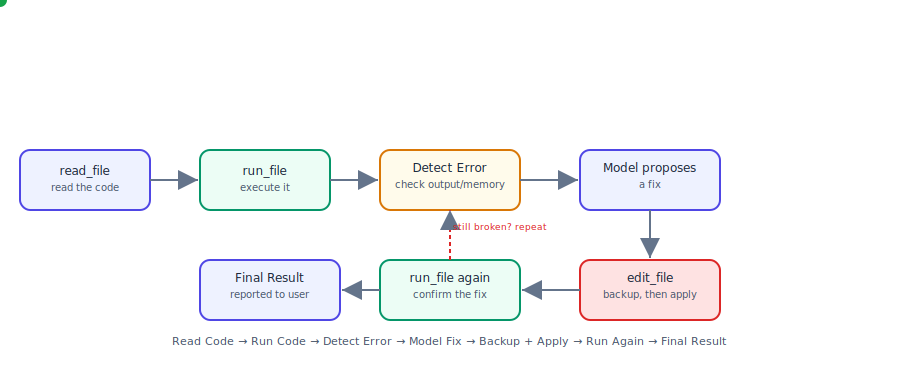

# Task 2 — System Prompt, Tool Layer, Memory, Flow & Safety

## The run/fix loop (animated)



The green dot traces one full error-fixing cycle: read the code, run
it, detect whether the output looks like an error, ask the model for a
fix, back up the file and apply the fix, run again, and report the
final result. If the second run still fails, the loop repeats from
"Detect Error" (dashed red arrow) instead of giving up immediately.

> This is a plain animated SVG — it renders on its own in GitHub,
> browsers, and most markdown viewers. Open `run_fix_loop.svg` directly
> if it doesn't animate wherever you're reading this.

---

## 1. System Prompt

The full text lives in the `SYSTEM_PROMPT` constant in `agent2.0.py`.
It's organized into clearly labeled sections so it's easy to point to
during the evaluation:

- **ROLE** — the agent works only inside one workspace folder and can
  create, read, explain, modify, and run code, and fix errors.
- **WORKSPACE LIMITS** — never touch anything outside the workspace;
  trust the automatic tool-level checks rather than retrying with a
  guessed path.
- **TOOL USAGE RULES** — which tool to use for which situation
  (`write_file` for new files, `edit_file` for existing ones, `read_file`
  before explaining, `run_file` to execute, etc.).
- **HANDLING UNCLEAR REQUESTS** — ask for clarification instead of
  guessing a filename; report tool errors plainly instead of inventing
  content.
- **HANDLING CODE ERRORS** — the exact 6-step sequence: read → run →
  identify the error → edit (with automatic backup) → run again →
  report the final result, repeating a few times if still broken.
- **SAFETY** — never attempt destructive commands, never skip the
  backup step.

## 2. Tool Layer

Every action the agent can take is its own small, clearly named
function, registered as a separate tool the model can call:

| Tool | What it does |
|---|---|
| `read_file` | Reads a file's content |
| `write_file` | Creates a new file, or overwrites an existing one — backs it up automatically first if it already exists |
| `backup_file` | Makes a standalone backup without changing the file |
| `list_files` | Lists files in the workspace |
| `run_file` | Runs a code file and returns its output |
| `run_command` | Runs a simple shell command inside the workspace |

`write_file` intentionally covers both "create" and "edit" — a file
that doesn't exist yet is created; a file that already exists is backed
up first, then overwritten. This keeps the tool count small without
losing the "always back up before changing a file" safety rule.

All of these share one security helper, `safe_path()`, which resolves
the requested path and confirms it's still inside the workspace before
any tool is allowed to touch it.

## 3. Run Tool

`run_file(path)` is the tool that actually executes code:

- **`.py`** → run with `sys.executable` (the same Python interpreter
  running the agent).
- **`.js`** → run with `node`.
- **`.cpp` / `.cc`** → compiled first with `g++` into a `.out` binary
  inside the workspace, then that binary is run. If compilation fails,
  the compiler's error output is returned immediately (no run attempt).
- Any other extension → a clear "unsupported file type" message.
- Every run has a **30-second timeout** so a stuck program can't hang
  the agent.

`run_command(command)` remains available for simple supporting steps
(e.g. installing a package), but is checked against a list of
dangerous patterns (`rm -rf`, `sudo`, `shutdown`, `mkfs`, fork bombs,
etc.) before it's allowed to run, and is always executed with
`cwd=WORKSPACE`.

## 4. Memory

A small JSON file, `.agent_memory.json`, is created inside the
workspace itself. It's updated after every tool call:

```json
{
  "workspace": "/path/to/workspace",
  "recent_files": ["app.py"],
  "operations": [
    {"time": "...", "tool": "run_file", "args": {"path": "app.py"}, "result_summary": "..."}
  ],
  "last_error": null,
  "last_fix_attempt": "Edited app.py after error at ..."
}
```

- `recent_files` — the last 10 files touched, most recent first.
- `operations` — a rolling log of the last 20 tool calls and their
  (trimmed) results.
- `last_error` — set whenever `run_file`/`run_command` output looks
  like an error (contains "error", "exception", or "traceback"), and
  cleared automatically the next time a run succeeds.
- `last_fix_attempt` — recorded whenever `write_file` is used on a file
  while an error was on record, so it's clear which write was meant to
  fix what.

This is intentionally simple: a handful of `if` checks and a JSON
read/write, no database or external service.

## 5. Execution Flow

**Normal flow** (create / explain / modify / run):

```
User Request → Understand Request → Select Tool → Execute Tool → Show Result
```

**Error-fixing flow** (e.g. "run app.py, fix the error, run again"):

```
Read Code → Run Code → Detect Error → Ask Model for a Fix
          → Backup + Apply Fix (write_file) → Run Again → Show Final Result
```

Both flows run inside the same bounded loop (up to 10 tool-call steps
per user request) already used in Task 1 — the model keeps calling
tools until it has a final plain-text answer, and each step is logged
to the terminal:

```
[USER REQUEST] ...
[TOOL SELECTED] ...
[TARGET] ...
[RESULT] ...
[ERROR DETECTED] ...      (only shown if the run looked like an error)
[FIX ATTEMPT] ...         (only shown right after an edit that follows an error)
[FINAL STATUS] done / failed / stopped (too many steps)
```

## 6. Safety Rules

- **Workspace boundary** — every tool resolves and checks the target
  path with `safe_path()` before touching anything; paths outside the
  workspace are refused with a clear error, and this check happens
  even before the user's message reaches the model (`precheck_file_reference`).
- **Backups before editing** — `write_file` always makes a timestamped
  backup before overwriting a file that already exists; new files don't
  need one since there's nothing to lose.
- **No dangerous commands** — `run_command` refuses anything matching
  a denylist of destructive patterns (`rm -rf`, `sudo`, `shutdown`,
  `mkfs`, fork bombs, etc.), regardless of how the request is phrased.
- **Workspace-scoped execution** — both `run_file` and `run_command`
  always run with `cwd=WORKSPACE`, and every execution has a timeout.
- **Clear errors, no guessing** — missing files, invalid model
  responses, and unsupported file types all return a specific error
  message instead of the agent inventing an answer.
