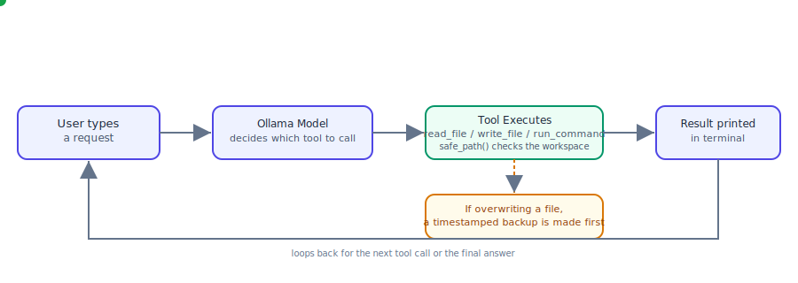

# Model / API and How the Agent Works

## How it works (animated)

The green dot traces one full request: the user types something, the
model decides which tool to call, the tool runs (checking the workspace
boundary along the way, and backing up any file it's about to
overwrite), the result is printed, and the loop starts again for the
next tool call or the model's final answer.

> This is a plain SVG animation — it renders on its own in GitHub,
> browsers, and most markdown viewers. If it doesn't animate wherever
> you're viewing this, open `model_flow.svg` directly.

---

## Which model/API is used

The agent talks to **Ollama's local API** (`http://localhost:11434/api/chat`),
not a cloud provider's API directly. Ollama itself is configured to use
a model of your choice — this can be a model running fully on your
machine, or one of Ollama's **cloud-hosted models** (e.g.
`gpt-oss:120b-cloud`), selected by editing the `MODEL` constant at the
top of `agent1.2.py`.

- If the chosen model is a cloud model, Ollama handles the actual
  network call to the cloud provider behind the scenes once you've run
  `ollama signin`.
- If the model needs an API key, the agent reads it from the
  `OLLAMA_API_KEY` environment variable and sends it as a Bearer token.
  The key is **never hardcoded** in the source code.
- All requests are sent using Python's `requests` library as plain
  HTTP POST calls to Ollama's `/api/chat` endpoint, using the standard
  OpenAI-style tool-calling format (`tools`, `tool_calls`).

## How the agent works, step by step

1. **Startup** — the program checks that a workspace folder exists and
   stores its absolute path in the global `WORKSPACE` variable. Every
   file operation is checked against this folder.

2. **Conversation loop** — the user types a natural-language request
   (e.g. "Explain app.py"). This is appended to a running list of chat
   messages and sent to the model.

3. **The model decides what to do** — instead of the program guessing
   whether the request is "create", "explain", or "modify", the model
   itself is given a list of tools it can call:
   - `write_file(path, content)` — create a new file or overwrite an
     existing one.
   - `read_file(path)` — read a file's content.
   - `run_command(command)` — run a simple terminal command inside the
     workspace (e.g. listing files).

   The model chooses which tool (if any) to call based on the request,
   and the program executes that tool call for real.

4. **Tool execution** — every tool function first resolves the given
   path with `safe_path()`, which:
   - joins relative paths onto the workspace,
   - resolves the full absolute path (following any symlinks),
   - confirms the result is still inside the workspace folder.

   If the path resolves outside the workspace, the tool returns an
   error string instead of touching anything.

5. **Automatic backups** — before `write_file` overwrites a file that
   already exists, it copies the original to a timestamped backup
   (e.g. `app.py.backup_20260701_101500`) using `shutil.copy2`, so the
   previous version is never lost.

6. **Multi-step tool use** — a single user request can trigger more
   than one tool call in sequence (for example, `read_file` first to
   see the current content, then `write_file` to save the change). The
   agent loops (up to 10 steps) feeding each tool result back to the
   model until it replies with a plain-text final answer instead of
   another tool call.

7. **Error handling** — the agent raises a clear `RuntimeError` message
   for the common failure cases: missing/invalid API response, network
   failure, authentication failure, or an empty model response. These
   are caught in the main loop and printed as `error: ...` without
   crashing the program.

## Why this design

- Letting the **model** decide which tool to call (instead of
  hand-written keyword rules) keeps the code very small — there's no
  separate classification step to maintain.
- Every tool still re-validates the workspace boundary independently
  with `safe_path()`, so even if the model tries to access a path
  outside the workspace, the action is refused before anything is
  read or written.
- The whole program is a single procedural file — no classes, no
  frameworks — so each function can be explained line by line during
  a live evaluation.
